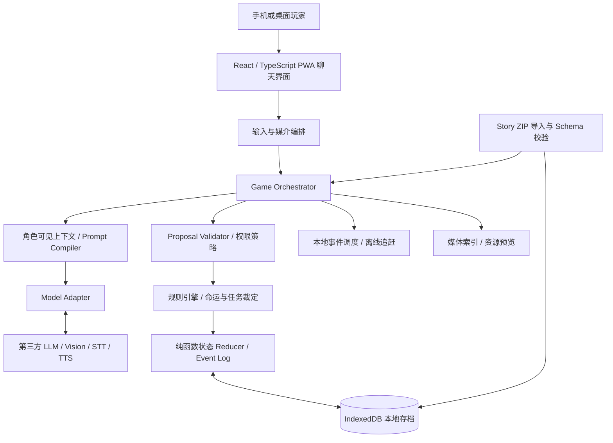

# AI 命运改写互动剧情游戏｜MVP 技术规格 v1.0

**版本日期：** 2026-10-08  
**状态：** 技术设计 / 可供工程拆解，不是可运行游戏  
**目标平台：** 手机浏览器、安装式 PWA、桌面浏览器  
**架构原则：** Mobile-first / Local-first / BYOK / Story-package-first / Engine independent

## 1. 产品目标及首版边界

玩家通过仿即时通讯软件，与小说世界中拥有独立人格的 AI 主角远程联系。玩家可选择路人、专家或系统身份，使用文字、图片及语音给主角建议，影响任务、人物关系和结局。主角与 NPC 有独立目标和认知，可能不采纳建议；行动成功与否由世界规则、证据、资源、人物能力及因果共同裁定，**不保证玩家一定成功，也不强制原著结局发生**。

### MVP 故事范围

- 1 个单元，体验时长约 30–60 分钟；1 名 AI 主角、2–3 名重要 NPC。
- 3 种玩家身份；至少 3 阶段任务；至少 2 个显著不同的结局，并验证一个原著命运被改变的路径。
- 文字双向聊天、剧情图片、语音输入（转文字）、AI 语音回复；图片理解作为有条件的模型能力。
- 手机与浏览器双形态；本地自动存档、手动导出/导入、离线时间追赶。
- 选择云端模型并自备 API Key；不建设在线账号、云端游戏状态服务和商业商城。

### 非目标

多人同世界、真人即时协作、关闭浏览器仍实时运行、实时 Web Push、完整视频聊天、自动生成所有场景图、付费内容商店、零门槛安全直连全部云模型、反作弊式隐藏真相、无上限自主 NPC 循环。以上预留接口，不属于 v1.0 验收项。

## 2. 技术架构

**信任边界：** 模型输出是未经信任的建议，不得直接修改状态；外部剧情包是不可信内容，必须校验格式、交叉引用、媒体类型与大小；剧情包描述中的“忽略系统指令”等只能作为故事文本，不得升级为系统命令。

## 3. 具体技术选型

| 组件 | 建议 | 原因 |
|---|---|---|
| UI | React + TypeScript + Vite | 生态与类型安全，手机优先布局 |
| 安装式 PWA | vite-plugin-pwa、Service Worker | 静态资源离线缓存和主屏幕安装 |
| 本地数据 | IndexedDB + Dexie（或同等封装） | 持久化消息、事件、媒体与包索引 |
| 游戏内核 | 纯 TypeScript，无 DOM 依赖 | 可测试、可未来复用到原生 App |
| 数据契约 | JSON Schema + Ajv；运行时 Zod/同等校验 | 输入、模型结构化输出和剧情包校验 |
| ZIP | 安全解包模块（如 fflate） | 浏览器中导入、导出包 |
| 状态管理 | Zustand 或简明 React 状态，真相以事件日志为准 | 避免 UI 状态成为权威游戏世界 |
| 测试 | Vitest + Playwright，真实设备手测 | 确定性单测、浏览器集成测试 |
| 视觉/语音 | 能力探测 + Provider Adapter | 不绑定单一 AI 供应商 |

部署为 HTTPS 静态站点；本地存储和规则执行不依赖业务服务器。**提示：** OpenAI、Anthropic、Gemini 对长期密钥在浏览器中的暴露均有安全警告；生产版不能将“任意云端 API Key 直接填进网页”视为无风险标准方案。实验性直连模式须明确风险，正式公开版应采用受支持的短期授权/安全连接方式（可能需要单独的凭证服务），且此服务不保存游戏进度。一个无状态转发代理只能解决跨域或路由问题，不能消除用户密钥在客户端 JS 中被读取的风险。

## 4. 八大模块及接口边界

| 模块 | 主要职责 | 对外接口（抽象） |
|---|---|---|
| 聊天与角色 | 接收玩家输入、流式消息、拟真消息、主角主动发言、分离可见与隐藏信息 | `chat.submit`, `chat.subscribe`, `chat.list` |
| 玩家身份 | 开局选择身份、知识边界、联系渠道、特殊权限与限制 | `identity.list`, `identity.select`, `identity.authorize` |
| 剧情包导入 | 解 ZIP、完整性检查、版本兼容、交叉引用和资源导入 | `storypack.inspect`, `storypack.install`, `storypack.list` |
| 命运与任务引擎 | 命运基准、任务依赖、成功/失败/失效判定、事件启停 | `task.evaluate`, `fate.reconcile`, `world.commit` |
| 人物动态状态 | 角色目标、关系、信任、误解、个人知识、物品及状态 | `actor.view`, `actor.propose`, `relationship.apply` |
| 多模态 | 照片附件、语音录制、STT、TTS、可选视觉理解 | `media.attach`, `media.transcribe`, `media.speak`, `media.inspect` |
| 存档及恢复 | 事件日志、快照、事务写入、导出导入、迁移与回滚 | `save.create`, `save.append`, `save.export`, `save.restore` |
| 离线时间推演 | 关闭期间排队、重开计算、时间窗推进、消息生成、预算保护 | `clock.advance`, `scheduler.catchUp`, `scheduler.cancel` |

详见 `contracts/runtime.ts`，该文件是定义草案，不是已实现代码。

## 5. 剧情包格式（Story Package 1.0）

- ZIP 根目录包含 `manifest.json`，文件路径采用相对路径与 UTF-8。
- `world.json`：不可变规则、历史事实、地点和证据事实。事实可以发现，但不能被语言模型凭空制造。
- `characters.json`：人物静态人格、目标、记忆边界、初始能力及关系。
- `player_roles.json`：路人/专家/系统的权限、可获得知识和主角初始信任偏置。
- `scenes.json`：可用地点、初始物品、离开/到达条件。
- `tasks.json`：阶段目标、前置条件、成功条件、失败条件、效果。
- `fate.json`：原著命运参考事件、触发依赖、可阻断/替代事件。
- `opening.json`：开场聊天及可见媒体引用。
- `assets/`：可选 JPG/WEBP、MP3/M4A/WEBM 等受支持的静态素材。

`schemas/` 的八类 JSON Schema 提供首版可校验契约。**所有类型化标识跨文件引用必须由导入器校验**：角色/任务/地点/事实/媒体 ID 不得悬空或重复。使用 `packId + packVersion + SHA256` 标记版本与内容；更换包版本前备份存档并执行迁移兼容检查。

### 导入安全边界（建议默认值，可根据真机测试调整）

压缩包总大小 ≤50 MiB、解压总量 ≤200 MiB、文件数 ≤500、单文件 ≤20 MiB、最大压缩比 ≤100。拒绝绝对路径、`../` 上级路径、符号链接/快捷链接、JS/HTML/SVG 等可执行或可注入资源；仅允许预定义白名单媒体 MIME 类型并校验文件魔数。不可使用 `eval` 运行剧情包脚本。扩展名不能代替内容检查。超限明确报错而非部分安装。

### 命运模型

原著基准时间线只作为 `baselineFates`，非必然发生的脚本。事件激活需要前置条件，且可被世界状态否决。如果原著中 A 因事件 X 死亡，而玩家救下 A，则所有依赖 `A 死亡` 的事件应重新求值，后续剧情由世界状态驱动而非继续照搬原著。

## 6. 本地运行状态和事件模型

**数据不混存：**

1. 包内容 `StoryDefinition`：作者定义的固定世界和原著基准，导入后只读。
2. `GameState`：某个玩家这一局的可变状态，包括当前时刻、任务、角色、关系、所知事实、物品和事件标记。
3. `EventLog`：已经被引擎确认的动作事件，追加式、不可原位编辑；关联 `causationId` 与 `idempotencyKey`。
4. `ChatLog`：可见/隐藏消息、媒体和生成元数据；不得直接充当世界状态源。
5. `Snapshot`：每 20 个确认事件或关键转折保存一次，含事件游标与摘要校验。

每次行动通过**同一 IndexedDB 事务**写入新事件、更新世界状态和生成结果消息的元数据，避免“任务成功了但没有存档”的半提交。浏览器不支持跨 tab 强事务协作时限制同一存档单写者，通过 Web Locks / 数据库租约协调。重试请求按幂等键去重。

任何角色的提示词只包含**该角色已知事实**、当前可观察场景、关系与目标，不能直接读取整个世界真相。注意：由于真相位于玩家本地，不能据此提供严格反作弊承诺。

### 玩家消息 → 世界状态 → 主角回复

1. 输入文字/图片/录音，记录来源和上传权限；语音先转写（玩家可编辑确认）。
2. 读取快照与当前角色的 `KnowledgeProjection`，包括已发现证据、角色目标、关系和已有计划。
3. 根据所选玩家身份验证是否有权提出特殊系统指令；普通建议永不直接成为世界改变事件。
4. 向模型提交人格与可见信息，获取结构化 `ActionProposal`，例如 `inspect(location)` 或 `ask(npc)`。
5. 校验提议数据结构、行动者、前置条件、资源、知识和风险；裁定接受、拒绝或部分执行。
6. 用纯函数 reducer 应用已裁定事件，事务写入本地库，重算任务和命运条件。
7. 用确认的事件结果（不是 AI 自行声称的结果）生成主角的最终聊天/图文语音消息。
8. 更新任务 UI、关系和存档，保留可追溯的事件原因。

对仅聊天、不改变世界的回合，可用一次模型调用；涉及不可逆改变的回合采用「提议 → 校验 → 结果叙述」两阶段，避免先叙述成功再发现校验失败。模型超时、无效 JSON、工具失败时保持上一个有效状态，显示重试，而不是盲目写入。

## 7. 自主性与命运裁定规则

- **玩家意图**是对主角的建议/请求，不等于主角指令；角色按人格、目标、情绪、关系、风险和可获得证据决定是否采纳。
- **角色提议**是模型输出，须经硬性世界规则过滤。物理不可达、缺关键物品、错误事实、NPC 拒绝配合可使任务失败。
- **结果裁定**先处理硬约束，再处理可执行行动的规则/确定性伪随机种子；概率不是“信任度高则必定成功”，必须有可解释的条件和风险。
- **NPC 攻略**由 NPC 自己的价值观、边界和利益决定。信任/亲密度只是状态指标，不等于自动同意；不可通过绝对数值强制产生关系。
- **世界事件**必须有可解释的因果指针：每个命运变更标记 `causedByEventIds[]`。人物被救后，其死亡后果链必须失效或者重评。
- **幕后知识**按 actor 划分可见范围；玩家角色与故事主人公的知识不必相同。
- **预算保护**：普通对话目标 1 次 LLM 调用、世界变化回合目标 2 次。超过上限须降级、请求确认或提示。API 用量显示为估算值，实际账单以供应商为准。

**同一时刻的裁定顺序：** 截止时刻先结算之前已确认完成的行动，再结算到期事件，最后接受新到达的玩家请求；`deadlineMinute=120` 的救援只有在故事分钟 `<120` 完成才可阻断死亡，恰好在 120 完成视为超时。确保临界点行为可重复，不因模型响应次序而改变。

### 行动类型（首版白名单）

`move`、`inspect`、`ask`、`share_information`、`use_item`、`wait`、`decline`、`request_help`。未列出动作不得作为任意代码执行；未来以版本化 action handlers 扩展。

## 8. 多模态与信息来源

输入消息分为 `text`、`image`、`audio`；输出支持文字、剧情包静态图、预录音频或模型 TTS。MVP 不强制实时通话或视频识别。

每份图像证据必须记录**来源**：

- `authored_story`：作者提供的剧情图片，可绑定正式线索事实。
- `in_world_capture`：游戏引擎确认主角在世界内拍摄的素材，可绑定场景及事实。
- `player_external`：玩家从现实上传的图片，只代表玩家提供的外部信息，不能自动证明小说世界中的事实。
- `generated_illustration`：模型生成的插图，不因画面细节自动新增证据。

视觉模型的自由描述只作为建议或非权威观察；证据解锁必须满足世界内的线索定义和检查条件。模型不具备 Vision 时回退到包中预写的图片描述；不具备 STT/TTS 时仍可用纯文字继续游戏。录音使用浏览器支持检测，不能固定编码格式；相机/麦克风访问必须按用户操作授权并使用 HTTPS。

## 9. 离线时间推演

**默认模式：** `on_resume`。关闭页面期间不运行模型、不发真实远程通知；仅记录现实退出/重开的时刻和未完成的行动计划。

重新打开时执行：

1. 以设备 UTC 时间计算实际间隔，并检测时钟大幅回拨。回拨则不倒退世界时间，只提示异常。
2. 按剧情包 `timeScale` 和 `maxCatchupHours` 限制可结算的叙事时长；超出部分按剧本定义折叠为“长时间经过”。
3. 优先处理确定性定时事件与角色已确认任务，之后按事件优先级决定是否请求 LLM 模拟细节。
4. 对每个事件执行前置条件校验、事务提交和任务/命运重算；进程崩溃重开可幂等继续。
5. 生成有时间戳的过去消息，按时间顺序显示；明确展示“补算结果”，不假装这些消息在关闭期间实时送达。
6. 若无网络、欠费或 API 不可用，只推进**明确可确定**的脚本事件；需模型决定的状态保持 `pending`，重连后继续。

建议首版：单次自动追赶最长 12 个叙事小时、最多处理 30 个事件、模型调用最多 5 次；过量要求玩家分批继续。离线结果不得提前读取已改变或被取消的原著事件。

## 10. 本地持久化、备份及安全

IndexedDB 数据表建议：`packs`、`assets`、`runs`、`messages`、`events`、`snapshots`、`actorStates`、`pendingActions`、`providerSettings`。不得把真实 API Key 写入存档、日志、截图或导出的备份。可提示 `navigator.storage.persist()` 请求更强的数据保留策略，但浏览器仍可能拒绝，用户清理站点数据仍会丢失存档。

导出格式 `save.zip` 包含 `save_manifest.json`（包 ID/版本/hash/游戏版本）、`events.jsonl`、`snapshot.json`、必要的玩家上传素材；导入时检查哈希、版本兼容、事件引用和状态摘要，不匹配则拒绝或进入迁移流程。导入前备份现有存档；不得覆盖另一局。可以在后续增加用户口令加密备份，但浏览器中的同源恶意脚本仍可读取运行时解密后的数据。

PWA 仅缓存应用壳和已安装剧情资源，不缓存 API Key 或私密 AI 请求。建议 HTTPS、严格 CSP、避免不受信任的第三方脚本与 HTML 注入。API 使用额外调用前展示网络数据发送说明。基础模型直连模式仅面向受控测试，公开版需评估安全凭证方案。

## 11. 开发阶段与交付 Gate

| 阶段 | 交付对象 | 准入/通过条件 |
|---|---|---|
| P0 契约冻结 | 本规格、JSON Schema、完整可解析 Demo 包、测试矩阵 | 包与存档字段版本确定、模拟包检查通过 |
| P1 本地引擎 | reducer、任务/命运条件 DSL、EventLog、角色状态 | 无 AI 也能通过固定输入重放 3 条剧情路径 |
| P2 对话接入 | 手机聊天 UI、人格/知识上下文、模型适配器、流式输出 | 主角不会读到未解锁的私密事实；无效模型输出不提交 |
| P3 身份与多模态 | 3 身份、权限策略、剧情图片、录音/STT、TTS | 权限生效；拒绝麦克风或视觉缺失时不阻塞纯文本游玩 |
| P4 PWA、存档、追赶 | Service Worker、安装、ZIP 导入、IndexedDB、备份/恢复、resume | iOS/Android/桌面关键场景通过；崩溃后可重试 |
| P5 整体 QA | 30–60 分钟 DEMO、回归、性能与安全 | 覆盖任务成功、任务失败、主角拒绝、命运改写和存档恢复 |

禁止先做复杂可视化剧情编辑器、商店、实时推送或通用插件市场；先确保故事引擎能够正确裁定。

## 12. 验收矩阵

| ID | 验收场景 | 合格条件 |
|---|---|---|
| AC-01 | 玩家发消息，主角回应并可能拒绝 | 对话符合性格，拒绝建议不被强制执行，消息顺序稳定 |
| AC-02 | 三种身份执行相同特权命令 | 只有拥有权限的身份可用系统能力，普通建议均可发出 |
| AC-03 | 导入有效 ZIP 与恶意 ZIP | 有效包安装成功；越界、重复 ID、超限、恶意路径、损坏包全部拒绝且不留半包 |
| AC-04 | 救下原著死亡人物 | 死亡依赖剧情不触发，受影响任务、关系和 NPC 计划重新求值 |
| AC-05 | 主角试图在无证据时“宣布破案” | 规则引擎拒绝提交任务成功，即使模型文本宣称成功 |
| AC-06 | NPC 不愿被攻略、玩家持续劝诱 | 不以数值阈值强制改变 NPC 意愿，事件反应符合设定边界 |
| AC-07 | 玩家上传与案件无关的现实照片 | 不创建新的故事内正式证据；照片保留外部来源标记 |
| AC-08 | 录音权限拒绝 / 无 Vision / 无 TTS | 文本游戏完整可玩，给出清晰降级提示 |
| AC-09 | 手动导出再导入存档 | 包 hash 匹配，事件游标与世界状态一致，聊天和媒体不丢失 |
| AC-10 | 模型超时、无效 JSON、网络断开 | 上一个状态保持有效；重试幂等，不产生重复证据或重复扣资源 |
| AC-11 | 关闭 8 小时后重新进入 | 调度在预算内补算，事件时间有序，无被取消原著事件复活 |
| AC-12 | 设备时间回拨、离线 30 天 | 不倒退时钟、不无限调用、不重复执行，超长时间窗口可分批或折叠 |
| AC-13 | 同剧情包不同种子、不同建议 | 至少存在两种有因果依据的合理结果；不能必胜或强制复现原著 |
| AC-14 | 包有作者隐藏真相但角色未知 | 角色上下文不含隐藏事实；模型未获知就不能引用事实 |
| AC-15 | PWA 从手机主屏幕启动并断网 | 已缓存 UI 和已安装剧情可打开并浏览；不能联网推理的步骤明确等待 |
| AC-16 | API Key 设置、导出、错误日志 | 日志、备份、URL、埋点和截图无原始 Key；公开版经过安全评估 |

建议最低自动化测试门槛：核心 reducer/条件 DSL ≥90% 分支覆盖；至少 30 条规则层集成测试 + 10 条命运改写回归用例 + 10 条包导入负例 + 5 条故障恢复用例；测试使用 FakeModel，不依赖真实 API 才能确保稳定。

**设备矩阵：** iOS Safari + 安装式 PWA、Android Chrome + 安装式 PWA、桌面 Chrome/Edge、桌面 Safari。每次发行记录实际系统和浏览器版本，不凭文档断言所有版本能力相同。

**可观察指标（目标，不是既成性能）：** 用户发消息后 UI 在 150ms 内本地回显；数据落盘最终一致性在单次事务完成前不显示不可逆成功；预算计量能够显示每回合请求次数与供应商可返回的 usage；原著被改变时可查看因果事件摘要。网络模型首字延迟不做绝对 SLA，测量 P50/P95 并按服务商统计。

## 13. 已识别风险与降级策略

| 风险 | 处理 |
|---|---|
| 浏览器长期 BYOK Key | 受控直连仅测试；公开版采用经安全评估的连接/委托方案；提示供应商限额 |
| 本地世界真相可被读取 | 默认单人不防作弊；后续联机或付费保密另设服务端权威层 |
| PWA 后台被系统挂起 | 统一 `on_resume` 离线追赶，不宣称实时主动消息 |
| 设备清理站点数据 | 手动 ZIP 导出/导入、定期备份提醒、持久存储许可请求 |
| 原著剧情逻辑崩坏 | 事实/状态/事件依赖硬约束，LLM 仅提议和演绎 |
| 人物卡泄露秘密 | `KnowledgeProjection` 精确按角色过滤，负向自动化测试 |
| API 花费失控 | 回合最大调用、离线追赶预算、实时 Token 估算、供应商侧限额提醒 |
| 不安全第三方 ZIP | Schema、文件白名单、hash、路径和解压限额校验 |
| 有版权的小说改编 | 对外发布前取得对应改编、发行及媒体资源授权 |

## 14. 来源与技术参考（2026-10-08 核查）

- MDN 浏览器存储保留与清除：<https://developer.mozilla.org/en-US/docs/Web/API/Storage_API/Storage_quotas_and_eviction_criteria>
- MDN PWA 后台限制：<https://developer.mozilla.org/en-US/docs/Web/Progressive_web_apps/Guides/Offline_and_background_operation>
- MDN 麦克风与 HTTPS：<https://developer.mozilla.org/en-US/docs/Web/API/MediaDevices/getUserMedia>
- OpenAI API Key 安全：<https://help.openai.com/en/articles/5112595-best-practices-for-api-key-safety>
- Anthropic TypeScript 浏览器支持说明：<https://platform.claude.com/docs/en/cli-sdks-libraries/sdks/typescript>
- Gemini Key 安全：<https://ai.google.dev/gemini-api/docs/api-key>
- Apple Web Push：<https://developer.apple.com/documentation/usernotifications/sending-web-push-notifications-in-web-apps-and-browsers>
- Ajv JSON Schema：<https://ajv.js.org/json-schema.html>
- OWASP ZIP 上传安全：<https://wstg.owasp.org/latest/4-Web_Application_Security_Testing/10-Business_Logic/09-Upload_of_Malicious_Files/>

### 设计状态说明

这是**工程设计基线**，`examples/` 内为虚构演示资料而非原著改编成品。代码接口和 schema 用于评审并冻结 v1.0 契约；尚未开发 PWA、游戏引擎、AI 适配器或完成真机兼容测试。
